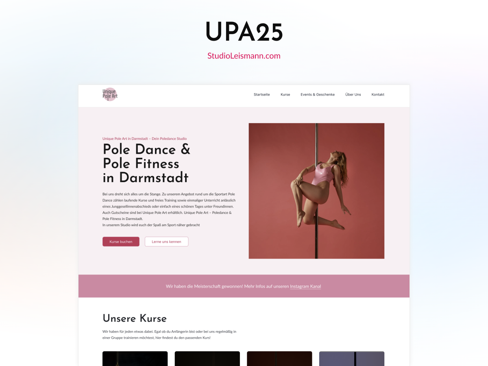

# upa25 WordPress Block Theme



This repository contains the **upa25** WordPress block theme used on
[Unique Pole Art](https://poledance-darmstadt.de). It includes a custom build
pipeline plus utilities that extend the block editor.

## Requirements

- WordPress 6.0+ (tested up to 6.6)
- PHP 8.0+
- Node.js LTS (for the build pipeline)

## Quick Start

1. Install dependencies:
   ```bash
   npm install
   ```
2. Build assets for production:
   ```bash
   npm run build
   ```
3. Start development with watch/live reload:
   ```bash
   npm start
   ```
4. Activate the theme from the WordPress dashboard.

## Scripts

- `npm start` - Development build with BrowserSync proxy (`http://uniquepoleart.local`).
- `npm run build` - Production build via `@wordpress/scripts`.
- `npm run lint:css` - Stylelint for `src/**/*.scss`.
- `npm run lint:css:fix` - Auto-fix eligible Stylelint issues.
- `npm run lint:js` - ESLint for `src/**/*.{js,jsx,json,ts,tsx}`.
- `npm run format` - Prettier formatting for JS/TS/JSON/CSS/SCSS.
- `npm run format:reorder` - Reorder CSS properties using `prettier-plugin-css-order`.
- `npm run zip` - Build a distributable theme zip.
- `npm run packages-update` - Update `@wordpress` dependencies.

## Docs

- See `docs/README.md` for build, source, and deployment notes.

## Repository Structure

- **assets/** - Source fonts and images.
- **build/** - Compiled CSS, JS, and optimized images (do not edit by hand).
- **inc/** - PHP files loaded from `functions.php`:
  - `setup.php` - Theme setup and editor styles.
  - `enqueuing.php` - Loads scripts/styles and enqueues CSS only for rendered blocks.
  - `block-variations.php` - Block variation registrations.
  - `block-styles.php` - Custom style variations for core blocks.
  - `block-patterns.php` - Pattern categories and remote pattern settings.
  - `dashboard-widget.php` - Dashboard widget with theme/server info.
  - `dev_*` files - Development helpers for cache and palette tasks.
- **parts/** - Template parts (headers, footers, etc.).
- **patterns/** - Block patterns organized in folders.
- **templates/** - Page templates (`home.html`, `front-page.html`, etc.).
- **styles/** - JSON style variations for blocks, parts, and sections.
- **src/** - SCSS and JavaScript source files for the build.
- **theme.json** - Global theme settings for the block editor.
- **style.css** - Theme header and basic information.

## Custom Utilities and Features

- **Utility classes panel** - `inc/dev_helpers.php` parses
  `src/scss/utilities/helpers.scss` and exposes helper classes inside the editor.
- **Dashboard widget** - Theme details and server information in the dashboard
  (`inc/dashboard-widget.php`).
- **Dynamic block CSS loading** - Only the CSS for blocks and style variations
  used on a page is enqueued (`inc/enqueuing.php`).
- **Block style variations** - Styles like `ghost` buttons or `picture-frame`
  images are registered in `inc/block-styles.php` and compiled from
  `src/scss/block-styles/`.
- **Pattern management** - Core patterns are disabled and custom categories are
  registered (`inc/block-patterns.php`).
- **Front-end scripts** - `src/js/scripts/` includes behavior like a fixed
  header (`header-fixed.js`) and draggable stickers (`sticker.js`).

When development helpers in `inc/dev_*.php` are enabled you can purge the theme
cache or remove the default color palettes with dedicated requests.

## Extending the Theme

### Block Style Variations

Register new block styles in `inc/block-styles.php`. Each variation gets its
own folder inside `src/scss/blocks` with a file named after the block and
prefixed by `core-`. For example, the indicator style for the paragraph block
lives at `src/scss/blocks/indicator/core-paragraph.scss`.

### Template Parts

1. Create an HTML file in the `parts/` folder and reference a pattern from it.
2. Add the corresponding pattern file inside `patterns/`.
3. Register the part in `theme.json`.

### Patterns

Custom pattern categories are registered in `inc/block-patterns.php`. If a
pattern does not show up, set `WP_DEVELOPMENT_MODE` to `theme` or `all`, or purge
the cache via `/wp-admin/?purge-theme-cache`.

### Block Variations

Additional block variations are loaded from `inc/block-variations.php`.

## License

upa25 is released under the [GPLv2](LICENSE).
